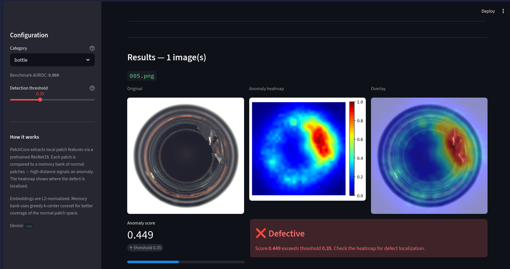
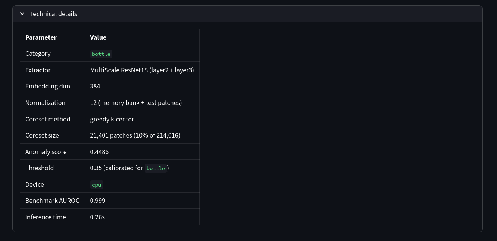
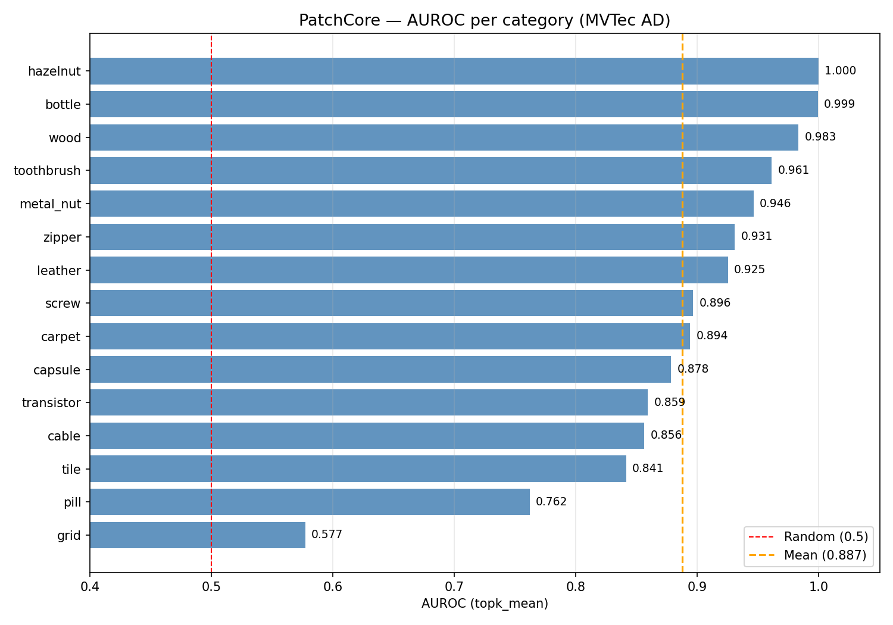

# 🔍 Industrial Anomaly Detection - PatchCore on MVTec AD


> 🇫🇷 Une version française de ce README est disponible dans [`README.fr.md`](README_fr.md)

Unsupervised anomaly detection on industrial images using **PatchCore** (ResNet18 multiscale features + greedy k-center coreset) benchmarked on the [MVTec AD dataset](https://www.mvtec.com/company/research/datasets/mvtec-ad).

---

## 🖥️ Demo

| Detection result | Technical details |
|:---:|:---:|
|  |  |

### How to use the app

**Step 1 - Select a category**
Choose the industrial part type from the dropdown (e.g. `bottle`, `capsule`, `screw`).
The model is trained on that specific category - always match the category to your image.

**Step 2 - Upload one or more images**
You can upload **multiple images at once** (PNG, JPG, JPEG).
Each image is analyzed independently and results are displayed one by one.

**Step 3 - Read the results**
Each image shows three panels:
- **Original** - your uploaded image
- **Anomaly heatmap** - red zones = high anomaly score, blue = normal
- **Overlay** - heatmap overlaid on the original for easy localization

**Step 4 - Interpret the score and verdict**
- **Anomaly score** - normalized value in [0, 1]. Higher = more likely defective.
- **Verdict** - ✅ Normal or ❌ Defective based on the detection threshold.
- **Detection threshold** - adjustable via the sidebar slider. Calibrated per category using the Youden index on the MVTec test set. Lower = more sensitive (more false positives). Higher = more conservative (more false negatives).

**Step 5 - Technical details**
Expand the *Technical details* section to see:
- Memory bank size (number of normal patches stored)
- Coreset method (greedy k-center)
- Embedding normalization (L2)
- Raw anomaly score and inference time

> ⚠️ **Important**: upload images that match the selected category. Uploading a bottle image while capsule is selected will produce unreliable results - the model has no reference for that part type.

---

## 🎯 Problem Statement

Anomaly detection in industrial inspection is challenging because:
- **Extreme class imbalance** - defective parts are rare (~1:1000 ratio)
- **No anomalous examples** at training time (one-class learning)
- **Subtle defects** - pixel-thin cracks, scratches, color variations
- **Complex backgrounds** - machining marks, repetitive textures

This project compares two families of approaches on MVTec AD:
- **Reconstruction-based** - Convolutional Autoencoders (V1, V2)
- **Feature-based** - PatchCore with multiscale ResNet18 embeddings

---

## 🧠 Methods

### Autoencoder (Reconstruction-based)
Train a CNN autoencoder on normal images only. At test time, high reconstruction error signals an anomaly. Two architectures compared:
- **V1** - shallow encoder/decoder (3 conv layers)
- **V2** - deeper architecture with upsampling decoder

**Fundamental limit**: a model that reconstructs too well will also reconstruct anomalies, degrading detection.

### PatchCore (Feature-based)
1. Extract multiscale patch embeddings from a frozen ResNet18 (layer2 + layer3)
2. Build a **memory bank** of normal patch embeddings (L2-normalized)
3. Apply **greedy k-center coreset** sampling (10%) for efficiency
4. At test time: compute nearest-neighbor distance per patch → anomaly map

---

## 📊 Results

### Capsule category - method comparison

| Method | AUROC mean | AUROC max | AUROC topk |
|--------|-----------|-----------|------------|
| AE V1 (reconstruction) | 0.398 | 0.627 | 0.556 |
| AE V2 (reconstruction) | 0.563 | 0.613 | 0.615 |
| **PatchCore (feature-based)** | **0.876** | **0.941** | **0.938** |

### PatchCore benchmark - all 15 MVTec categories



| Category | AUROC (topk) | Threshold |
|----------|-------------|-----------|
| bottle | 0.999 | 0.351 |
| cable | 0.981 | 0.402 |
| capsule | 0.886 | 0.296 |
| carpet | 0.970 | 0.347 |
| grid | 0.847 | 0.353 |
| hazelnut | 0.999 | 0.419 |
| leather | 0.991 | 0.338 |
| metal_nut | 0.990 | 0.385 |
| pill | 0.870 | 0.368 |
| screw | 0.866 | 0.349 |
| tile | 0.989 | 0.385 |
| toothbrush | 0.989 | 0.367 |
| transistor | 0.945 | 0.397 |
| wood | 0.991 | 0.383 |
| zipper | 0.944 | 0.327 |
| **Mean** | **0.957** | - |

Thresholds computed using the **Youden index** (maximizes TPR − FPR on the test set).

---

## 📁 Project Structure

```
industrial-anomaly-detection/
├── app/
│   └── app.py                  # Streamlit application
├── mvtec_dataset/
│   └── mvtec.py                # MVTec AD PyTorch Dataset
├── models/
│   ├── autoencoder.py          # CNN Autoencoder V1
│   ├── autoencoder_v2.py       # CNN Autoencoder V2
│   ├── patchcore.py            # PatchCore pipeline
│   └── checkpoints/            # Saved model weights (.pth)
├── evaluation/
│   └── metrics.py              # AUROC, scoring functions
├── training/
│   └── train_autoencoder.py    # Training script (CLI)
├── scripts/
│   └── prepare_memory_banks.py # Precompute coreset memory banks
├── utils/
│   └── normalization.py        # Image preprocessing
├── visualization/
│   └── heatmap.py              # Anomaly map visualization
├── notebooks/
│   ├── 01_autoencoder_experiments.ipynb
│   ├── 02_patchcore_experiments.ipynb
│   ├── 03_embedding_analysis.ipynb
│   ├── 04_multicategory_benchmark.ipynb
│   └── 05_final_comparison.ipynb
├── outputs/
│   ├── figures/                # Plots and visualizations
│   └── metrics/                # JSON results
├── pyproject.toml
└── README.md
```

---

## ⚙️ Installation

### Prerequisites
- Python 3.11
- [Poetry](https://python-poetry.org/docs/#installation)

### Clone & install

```bash
git clone https://github.com/Machoudi-1/industrial-anomaly-detection.git
cd industrial-anomaly-detection
poetry install
```

### Dataset

Download the [MVTec AD dataset](https://www.mvtec.com/company/research/datasets/mvtec-ad) and place it at:

```
data/mvtec_ad/
├── bottle/
├── capsule/
├── ...
└── zipper/
```

---

## 🚀 Usage

### 1. Train the autoencoder

```bash
# Train V2 on capsule (30 epochs, default)
poetry run python training/train_autoencoder.py --category capsule --version v2

# Train V1 on bottle with custom settings
poetry run python training/train_autoencoder.py --category bottle --version v1 --epochs 50 --lr 1e-3
```

### 2. Run the benchmark (PatchCore on all 15 categories)

Open and run `notebooks/04_multicategory_benchmark.ipynb`.
Set `SAVE_MEMORY_BANKS = True` to save memory banks for the app.

### 3. Prepare memory banks for the app

```bash
# Precompute L2-normalized greedy coreset banks (run once)
poetry run python scripts/prepare_memory_banks.py

# Custom paths (e.g. on Colab)
python scripts/prepare_memory_banks.py \
    --input-dir /path/to/memory_banks \
    --output-dir /path/to/memory_banks/ready
```

### 4. Launch the Streamlit app

```bash
poetry run streamlit run app/app.py
```

Then open `http://localhost:8501` in your browser.

---

## 📚 References

- **PatchCore**: Roth et al., *Towards Total Recall in Industrial Anomaly Detection*, CVPR 2022. [arxiv](https://arxiv.org/abs/2106.08265)
- **MVTec AD**: Bergmann et al., *MVTec AD - A Comprehensive Real-World Dataset for Unsupervised Anomaly Detection*, CVPR 2019.
- **Focal Loss**: Lin et al., *Focal Loss for Dense Object Detection*, ICCV 2017.
- **BAGAN**: Mariani et al., *BAGAN: Data Augmentation with Balancing GAN*, 2018.

---

## 👤 Author

**Machoudi ADEGOUNTE** — Applied Mathematics & Machine Learning 